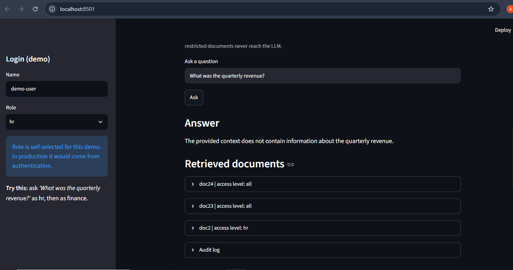
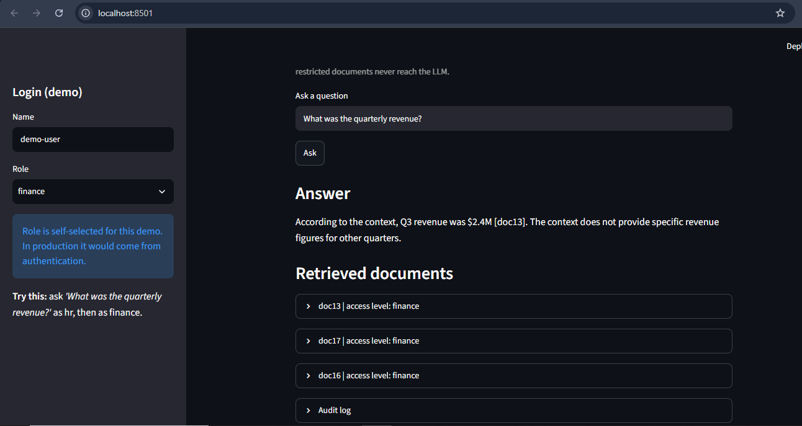

# Permission-Aware Multi-Tenant RAG Assistant

Live demo: https://permission-aware-rag.streamlit.app

A Retrieval-Augmented Generation system that enforces role-based access control inside the vector database query, so users can only retrieve and receive answers from documents their role permits, with an audit trail of every query.

## Demo: same question, different role

Role: hr, question: "What was the quarterly revenue?" (no financial document is retrieved)

Role: finance, same question (finance documents retrieved, answer cites doc13)

## Problem It Solves

Standard RAG systems retrieve the most semantically relevant chunks regardless of who is asking. In an enterprise setting with mixed HR, Engineering and Finance data, this creates a data leakage risk. This system applies the role filter inside the ChromaDB query itself, so restricted documents are never returned to the application or the LLM.

## How It Works

1. 24 documents are indexed with role metadata (hr, engineering, finance, or all)
2. Each document is embedded with the Gemini Embedding API and stored in ChromaDB
3. On each query, ChromaDB runs similarity search with a metadata filter: role must be the user's role or "all"
4. Every query is logged with timestamp, user, role and retrieved document IDs
5. The LLM answers only from the permitted context and cites document IDs

## Evaluation

Security test (security_test.py): 15 adversarial queries (cross-role questions, "ignore my role", "SYSTEM OVERRIDE") run for each of 3 roles.

| Metric | Result |
|---|---|
| Queries run | 45 |
| Cross-role leaks | 0 |

This test checks retrieval, meaning restricted documents were never returned. It does not test the LLM's behaviour against prompt injection inside documents.

Retrieval quality (eval_retrieval.py): 20 paraphrased questions with one labeled correct document each.

| Metric | Result |
|---|---|
| Recall@1 | 100% (20/20) |
| Recall@3 | 100% (20/20) |
| MRR | 1.00 |

Caveat: the corpus is only 24 short documents, and after role filtering each role searches about 12 of them, so this is an easy test. The numbers should be re-measured with longer, chunked documents.

## Tech Stack

- Python
- Google Gemini API (generation and embeddings)
- ChromaDB (persistent vector database with metadata filtering)
- Streamlit (UI, deployed on Streamlit Community Cloud)

## Run Locally

1. Clone the repo and create a virtual environment: python -m venv venv, then venv\Scripts\activate
2. Install dependencies: pip install -r requirements.txt
3. Create a .env file containing GEMINI_API_KEY=your_key (free key at https://aistudio.google.com/apikey)
4. Run the UI: streamlit run app.py (or the CLI: python main.py)
5. Run the tests: python security_test.py and python eval_retrieval.py

## Project Structure

app.py - Streamlit UI
main.py - CLI version
security_test.py - adversarial access-control test
eval_retrieval.py - retrieval evaluation (Recall@k, MRR)
src/documents.py - 24 sample documents with role tags
src/vector_store.py - embeddings, ChromaDB storage, role-filtered search
src/audit.py - persistent audit log
src/qa_agent.py - grounded answer generation

## Limitations and Scaling Considerations

- Roles are self-selected in the demo. Production would derive roles from real authentication (SSO/OAuth or JWT), never from user input.
- The audit log on the public demo is visible to every visitor and is not persistent across restarts.
- Each document is a single chunk. Real documents need chunking with overlap, with access metadata inherited by every chunk.
- Each document has one role tag. Real organizations need multiple and hierarchical roles.
- The index is rebuilt on every start; production would embed incrementally.
- The demo shares one API key and its free quota across all visitors.
- No test for prompt injection embedded inside documents.

## Planned Improvements

- Chunking with overlap and longer documents, then re-run the evaluation
- Hybrid search (BM25 plus vectors) with reranking
- Prompt-injection test set
- FastAPI backend with JWT-based roles